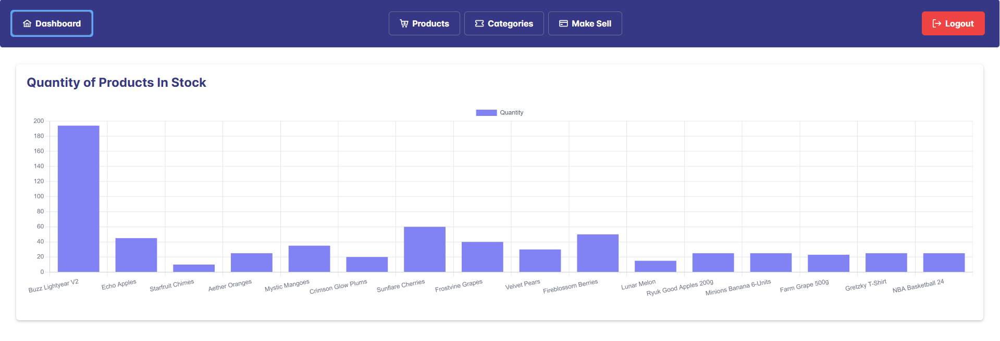
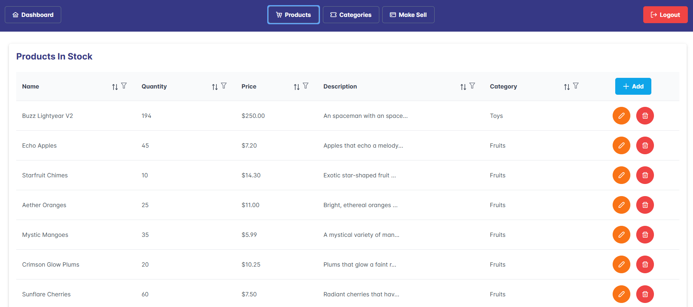
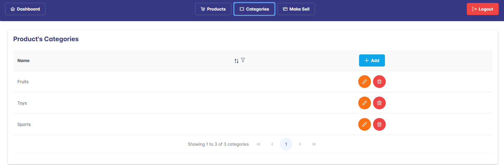
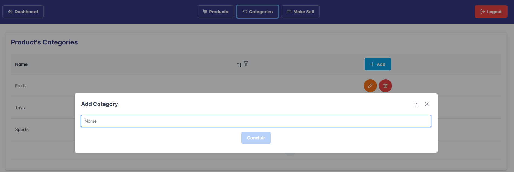
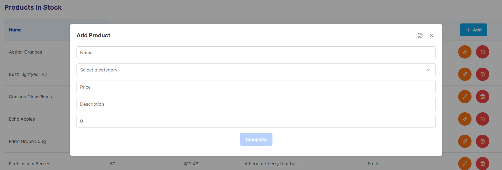
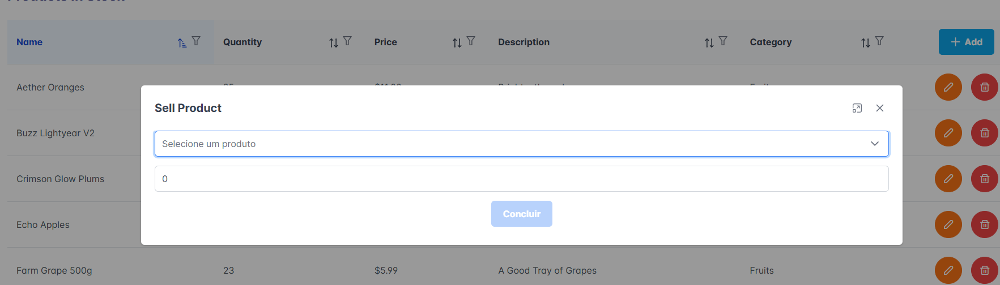

# Mini Stock Control



An intuitive and easy-to-use interface for managing stock levels, categories, and products. This project includes a back-end API to handle user authentication, category management, product management, and sales processing. The API is designed to be secure and efficient, ensuring that all operations are performed smoothly and accurately.

## Features

- User authentication and management

- Category creation, listing, updating, and deletion

- Product creation, listing, updating, and deletion

- Sales processing and stock level management

- Detailed API documentation with request and response examples

## Getting Started

To get started with the Mini Stock Control project, follow these steps:

1. Clone the repository:
  ```sh
  git clone https://github.com/deyvidsalvatore/Mini-Stock-Control.git
  ```
2. Navigate to the project directory:
  ```sh
  cd Mini-Stock-Control
  ```
3. Install the dependencies:
  ```sh
  npm install
  ```
4. Set up the environment variables:
  ```sh
  cp .env.example .env
  ```
5. Start the development server:
  ```sh
  npm start
  ```

## Back-end API Endpoints

### User Routes

- **Create User**
  - **POST** `/user`
  - **Request Body**:
    ```json
    {
      "name": "string",
      "email": "string",
      "password": "string"
    }
    ```
  - **Responses**:
    - `201`: User created successfully
    - `400`: Bad request

- **Authenticate User**
  - **POST** `/auth`
  - **Request Body**:
    ```json
    {
      "email": "string",
      "password": "string"
    }
    ```
  - **Responses**:
    - `200`: Authentication successful
    - `401`: Unauthorized

### Category Routes

- **List Categories**
  - **GET** `/category`
  - **Headers**: Requires authentication
  - **Responses**:
    - `200`: List of categories
    - `401`: Unauthorized

- **Create Category**
  - **POST** `/category`
  - **Headers**: Requires authentication
  - **Request Body**:
    ```json
    {
      "name": "string",
      "description": "string"
    }
    ```
  - **Responses**:
    - `201`: Category created successfully
    - `400`: Bad request

- **Update Category**
  - **PUT** `/category`
  - **Headers**: Requires authentication
  - **Request Body**:
    ```json
    {
      "id": "string",
      "name": "string",
      "description": "string"
    }
    ```
  - **Responses**:
    - `200`: Category updated successfully
    - `404`: Category not found

- **Delete Category**
  - **DELETE** `/category`
  - **Headers**: Requires authentication
  - **Request Body**:
    ```json
    {
      "id": "string"
    }
    ```
  - **Responses**:
    - `200`: Category deleted successfully
    - `404`: Category not found

### Product Routes

- **List Products**
  - **GET** `/product`
  - **Responses**:
    - `200`: List of products

- **Create Product**
  - **POST** `/product`
  - **Headers**: Requires authentication
  - **Request Body**:
    ```json
    {
      "name": "string",
      "price": "number",
      "description": "string",
      "amount": "number",
      "category_id": "string"
    }
    ```
  - **Responses**:
    - `201`: Product created successfully
    - `400`: Bad request

- **Edit Product**
  - **PUT** `/product`
  - **Headers**: Requires authentication
  - **Request Body**:
    ```json
    {
      "product_id": "string",
      "name": "string",
      "price": "number",
      "description": "string",
      "amount": "number",
      "category_id": "string"
    }
    ```
  - **Responses**:
    - `200`: Product updated successfully
    - `404`: Product not found

- **Delete Product**
  - **DELETE** `/product`
  - **Headers**: Requires authentication
  - **Request Body**:
    ```json
    {
      "product_id": "string"
    }
    ```
  - **Responses**:
    - `200`: Product deleted successfully
    - `404`: Product not found

- **Sale Product**
  - **POST** `/product/sale`
  - **Headers**: Requires authentication
  - **Request Body**:
    ```json
    {
      "product_id": "string",
      "amount": "number"
    }
    ```
  - **Responses**:
    - `200`: Sale processed successfully
    - `400`: Invalid sale request

## Schemas

### User Schema
```json
{
  "name": "string",
  "email": "string",
  "password": "string"
}
```

### Category Schema
```json
{
  "name": "string",
  "description": "string"
}
```

### Product Schema
```json
{
  "name": "string",
  "price": "number",
  "description": "string",
  "amount": "number",
  "category_id": "string"
}
```

### Sale Product Schema
```json
{
  "product_id": "string",
  "amount": "number"
}
```

## Contributing

We welcome contributions to the Mini Stock Control project! If you have any ideas, suggestions, or bug reports, please open an issue or submit a pull request.

## License

This project is licensed under the MIT License. See the [MIT License](https://opensource.org/licenses/MIT) for more details.

